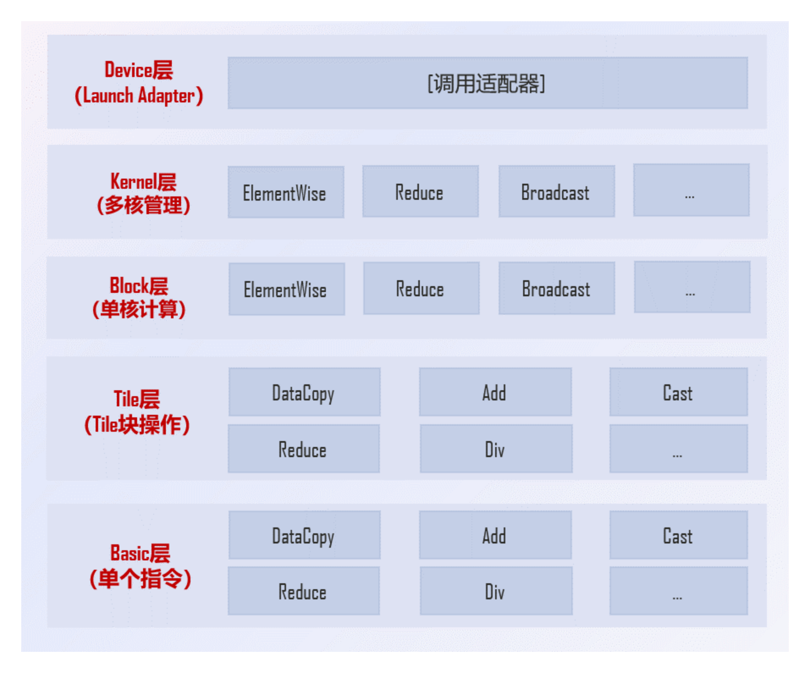

# ATVOSS 项目概述

## 目录

- [1. ATVOSS 简介](#atvoss-简介)
- [2. 核心架构](#核心架构)
- [3. 核心特性](#核心特性)
- [4. 适用场景](#适用场景)
- [5. 支持的产品型号](#支持的产品型号)
- [5. 相关文档](#相关文档)

---

## ATVOSS 简介

ATVOSS 针对昇腾 AI 处理器的 Vector 计算多核并行过程，提供了一套统一的编程模型，通过封装 Ascend C 的底层 API 和复杂的 Tiling 计算，大幅降低了算子开发的复杂度，使开发者能够用声明式的方式描述计算逻辑，实现高效的 Vector 算子开发。

## 核心架构

ATVOSS 采用层次化的架构设计，从高到低分为五层，每层职责清晰，抽象程度逐步递减：

| 层级 | 职责 | 主要功能 |
|------|------|----------|
| **Device 层** | Host 侧调用总入口 | 参数校验、ACL 资源管理、Host 与 Device 数据管理、切分计算、Workspace 管理、Kernel 调用 |
| **Kernel 层** | Kernel 函数总入口 | 多核间任务分解，控制 Block 调度 |
| **Block 层** | 单核任务分解 | 将任务分解到多个 Tile 块，控制数据搬运/计算流水编排 |
| **Tile 层** | Ascend C 封装 | 封装基础 API，提供大 Tile 块的搬运、计算能力 |
| **Basic 层** | 基础操作 | 使用 Ascend C 基础 API 完成数据搬运计算 |

<br><br>

这种分层架构使得开发者可以专注于计算逻辑描述，而无需关注底层的硬件细节和并行调度策略。

### Device 层
Device 层是 ATVOSS 的最高层，提供了与 Host 侧交互的完整接口。主要职责包括：
- 参数校验和合法性检查
- ACL 资源初始化和释放
- Host 与 Device 内存管理
- 计算任务切分和调度
- Kernel 函数调用和同步

开发者通常通过 DeviceAdapter 使用 Device 层功能，无需直接处理底层细节。

### Kernel 层
Kernel 层负责多核并行计算的任务调度。主要职责包括：
- 分析计算任务的并行度
- 将任务分解到多个 AI Core
- 控制 Block 的执行策略（均匀分段、动态负载均衡等）
- 协调多核间的数据依赖关系

核心组件是`KernelBuilder<BlockOp>`，通过 KernelPolicy 可以配置核数、分段策略等参数，通过KernelSchedule实现不同的并行调度策略。

### Block 层
Block 层处理单核内的多个 Tile 块计算。主要职责包括：
- 将任务分解为 Tile 块
- 编排数据搬运和计算的流水线
- 管理 TPipe（传输管道）和 double buffer
- 优化数据局部性和计算效率

核心组件是`BlockBuilder<Compute>`，BlockPolicy 配置了单核内存使用上限和 Tile 形状，通过BlockSchedule 实现调度。

### Tile 层
Tile 层封装了 Ascend C 的基础 API，提供了更高层次的抽象。主要职责包括：
- 提供 VecIn、VecOut 等数据搬运接口
- 封装 Add、Mul、Sqrt 等计算操作
- 支持 ReduceSum、Broadcast 等归约和广播操作
- 自动处理数据类型转换和精度问题

核心组件是各种Assign函数（如AddAssign、SqrtAssign）开发者主要通过 Tile 层 API 描述计算逻辑，无需直接操作 Ascend C 的底层接口。

### Basic 层
Basic 层直接使用 Ascend C 基础 API，是整个架构的底层支撑。虽然开发者通常不直接使用这一层，但它保证了 ATVOSS 的灵活性和性能上限。

## 核心特性

### 极简编程
ATVOSS 采用表达式模板技术，封装了计算表达模板，可实现简洁的 Vector 计算表达。开发者仅需几行代码即可描述复杂的算子计算逻辑，大幅减少代码量和开发时间。例如，实现 RMSNorm 算子仅需定义输入输出占位符和计算表达式。
```cpp
// Tile 块切分设置
using TileShape = Atvoss::Shape<1, 32>;

template <typename T1, typename T2, typename T3>
struct RmsNormConfig {
    using DtypeV1 = T1;
    using DtypeV2 = T2;
    using DtypeV3 = T3;
    struct RmsNormCompute {
        template <template <typename> class Tensor>
        __host_aicore__ constexpr auto Compute() const
        {
            auto in1 = Atvoss::PlaceHolder<1, Tensor<DtypeV1>, Atvoss::ParamUsage::IN>();
            auto in2 = Atvoss::PlaceHolder<2, Tensor<DtypeV2>, Atvoss::ParamUsage::IN>();
            auto out = Atvoss::PlaceHolder<3, Tensor<DtypeV3>, Atvoss::ParamUsage::OUT>();
            auto _1 = Atvoss::ReduceSum<Atvoss::Pattern::AR>(in1 * in1);
            auto _2 = Atvoss::Broadcast<Atvoss::Pattern::AB>(_1);
            auto _3 = in1 / Atvoss::Sqrt(Atvoss::Divs<WIDTH>(_2));
            return out = in2 * _3;
        }
    };
};
```

### 高效性能
ATVOSS 支持编译期优化，表达式模板在编译期构建类型化的抽象语法树，实现零运行时开销。开发者可以根据实际场景灵活配置 Block 策略、Kernel 策略和 Tile 形状，实现最佳性能表现。
```cpp
// 配置 Block 策略
static constexpr Atvoss::Ele::DefaultBlockPolicy<TileShape> blockPolicy {
    TileShape{}
};
// 配置 Kernel 策略
static constexpr Atvoss::Ele::DefaultKernelPolicy kernelPolicy {
    Atvoss::Ele::DefaultSegmentPolicy::UniformSegment
};
```

### 高扩展性
ATVOSS 采用模板设计，支持自由组合和扩展。开发者可以轻松自定义运算符、广播模式、归约操作等，满足多样化的算子需求。


## 适用场景

ATVOSS 适用于以下场景：
- **Vector 类算子开发**：需要在昇腾硬件上开发**逐元素计算**算子的场景，如数学运算、类型转换、激活函数等。
- **快速原型开发**：需要快速实现算子原型并进行验证的场景，ATVOSS 提供简洁的编程方式加速开发过程。

### 硬件支持
- **Ascend 950PR/Ascend 950DT**

### 软件依赖
- **CANN 版本**：8.5.0 及以上版本
- **编译器**：GCC 7.3.0 及以上版本
- **构建工具**：CMake 3.16.0 及以上版本
- **Python**：3.7.0 及以上版本（建议不超过 3.10）

### 系统要求
- **操作系统**：支持主流 Linux 发行版（如 Ubuntu、CentOS）
- **架构**：支持 x86_64 和 aarch64 架构
- **驱动**：需要安装对应型号的 NPU 驱动和固件

ATVOSS 持续更新以支持更多昇腾硬件型号，请关注项目发布说明获取最新支持信息。

## 相关文档
- [目录结构](./directory_structure.md) - 目录结构
- [开发者指南](./tutorials/developer_guide.md) - 详细的开发流程
- [API文档](./api/README.md) - API文档